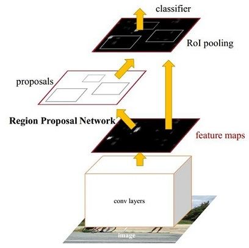
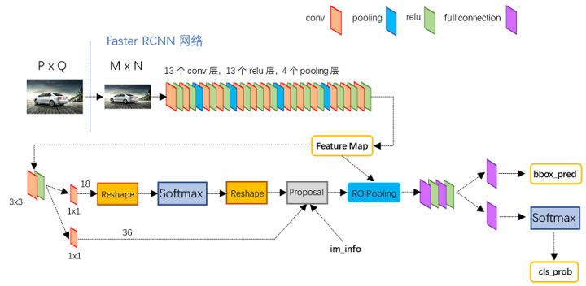

# Object Detection Paper Reading

## RCNN

### 网络结构

### 流程

1. 生成类别独立的候选框。
    - 使用selective search：选择性搜索是用于目标检测区域提议算法，它计算速度快，具有很高的召回率，基于颜色、纹理、大小和形状兼容计算相似区域的分层分组。优势：1.捕捉不同尺度；2.多样化；3.快速计算。
2. 使用神经网络(预训练)对每个候选框提取特征。
3. 使用SVM用候选框分类。

### 创新点

1. 在 Pascal VOC 2012 的数据集上，能够将目标检测的验证指标 mAP 提升到 53.3%,这相对于之前最好的结果提升了整整 30%.
2. 这篇论文证明了可以让神经网络应用在自底向上的候选区域，这样就可以进行目标分类和目标定位。
3. 这篇论文也带来了一个观点，那就是当你缺乏大量的标注数据时，比较好的可行的手段是，进行神经网络的迁移学习，采用在其他大型数据集训练过后的神经网络，然后在小规模特定的数据集中进行 finetune 微调。

### 缺点

1. 对每一个候选框都通过卷积神经网络提取特征，有非常多的重复计算，极大的增加了计算时间。
2. 使用SVM进行分类，需要把所有候选框的特征进行保存，占用大量的磁盘空间。
3. 采用的是传统图像处理的方式提取候选框，可能有遗漏，影响精度。
4. 训练流程有多步，比较繁琐，不易训练。

---

## SPPNet：加速RCNN

### 流程

1. 通过预训练的卷积神经网络提取特征。
2. 使用SPP提取每个候选框的特征。
3. 使用SVM进行分类和全连接层对位置回归。

### 创新点

1. 只进行一次特征提取，很大程度的减小了计算量，极大的加快检测速度(对于RCNN有100倍的速度提升)。
2. 提出Spatial Pyramid Pooling(SPP)，可以映射候选框的位置，提取出一个候选区域的特征。

### 缺点

1. 仍然占用大量的磁盘空间，和RCNN的原因一致。
2. spatial pyramid pooling上面的卷积层不能更新参数，导致使用深层卷积网络时，网络表现受限。

---

## Fast-RCNN：使用RoI层，改进RCNN和SPPNet的缺点

### 网络结构

### 流程

1. 通过卷积神经网络提取特征。
2. 通过RoI层提出每个候选框的特征。
3. 使用神经网络对类别和位置进行回归，直接得到检测结果。

### 创新点

1. 更好的表现。
2. 使用多任务损失的单阶段训练。
3. 训练可以更新所有网络层参数。
4. 不需要磁盘缓存特征。

### 缺点

1. 使用传统的图像处理方法提取候选框速度还是慢。

---

## Faster-RCNN：引入RPN层，加快候选框的选择速度

### 网络结构

### 流程

1. conv layers提取图片的特征。
2. RPN用于生成region proposals。该层通过1x1的卷积计算出该部分属于前景/背景的概率(上图RPN的上半部分，假设了以这个点为中心的候选框有9个，每个框有前景/背景2个类别，所以共有18个channel)，同时修正候选框位置(RPN下半部分，一共4修正4个坐标，所以有9*4=36个channel)。
3. RoI pooling，收集前面RPN生成的候选框，在feature map上进行映射后送入到后面的分类网络判定目标类别以及计算目标的精确定位。
4. 两个小分支，上面的分支计算目标的精确位置，下面的分支计算具体类别。

### 创新点

1. 使用RPN更快的选择候选框，比较于使用selective search算法又有了10倍的速度提升。
2. 将特征提取、region proposals的选取、bounding box regression、classification集合到了一个网络中。

---

## FPN：增强backbone对多尺度目标的检测效果

### 特征抽取方式对比

- a图的方法是对图片进行不同程度的下采样，然后分别使用卷积神经网络进行特征抽取、检测。处理同一张图片时要对多个scale分别进行特征抽取，导致速度非常慢。
- b图像faster-RCNN和faster-RCNN的做法，使用一次卷积，对图片进行特征抽取，然后检测。因为经过多次的缩小feature map，导致丢失了图片中小目标的特征。
- c图像SSD采用多尺度特征融合的做法，但是作者认为其没有用到足够底层的特征，对小物体的处理效果还不够好。
- d图通过顶层特征通过上采样和低层特征融合，对多尺度问题有着不错的解决效果。

### FPN实现

如上图，img1通过conv1x1的卷积进行降维，img2通过上采样(插值)，使两者尺寸相同，然后对应位置相加，得到img3。

这样既可以得到上层的语义特征，也可以得到下层的位置特征。

### 效果对比

- a和b对比可以发现上层特征不一定比下层有用。
- a、b和c的对比可以发现FPN有比较明显的效果。
- d表示的是只有横向的连接，没有自顶向下做上采样的过程，作者认为效果并不好的原因是不同层之间的语义鸿沟比较大。
- e表示只有自顶向下的上采样过程，没有横向连接，原因是特征在不断的采样过程中丢失了低层的位置信息，只是通过上采样并不能恢复很准确。
- f表示的只选择通过特征抽取再上采样恢复的最后特征，证明了金字塔不同层次的检测能力，但效果和FPN还是有不小的差距，说明金字塔的不同层次可以对不同尺度有更好的鲁棒性。另外，作者在这层专门使用了很多的anchor，但是效果并没有好很多，说明单纯的增加anchor的数量也不能有很好的提升效率。

---

## Mask-RCNN：目标检测的同时增加实例分割任务

### 网络结构

#### 从下往上来看

#### Backbone

使用了`resnet`+`FPN`来解决多尺度的问题。

#### RPN

和之前的Faster-RCNN没有什么区别，起到选出候选框的作用。

#### RoIAlign

改进RoI pooling，针对其像素未对齐的缺点：RoI pooling是将候选框映射到feature map上，用的是adaptive_max_pooling(pytorch)的方式进行计算，这样可能会出现pooling后，不同pooling后的元素映射不同数量pooling前的元素，如下图。

改进后的RoIAlign使用了插值的方式，如下图。最后pooling的尺寸为2x2，我们先对应坐标平均分为4个单元bins。在每个单元内，我们再分为4个小块(这个可以调整，为1也可以)，用插值算法求出这4个小块中心点的特征值，然后求一个max就作为这一个单元bin的结果。

使用RoIAlign就可以达到使元素一一对应的效果。

#### mask branch

上一步RoIAlign可以得到候选框的特征，再传入mask分支来计算前景对象的mask结果。这里我们只使用sigmoid计算前背景即可，不需要对每个类别进行细节，分类的任务交给classification完成。论文后面剥离实验可以证明这样做效果更好。

#### box regression & classification

这里就是传统的分类和位置坐标回归的计算了。

### 创新点

1. 提出RoIAlign解决之前RoI pooling中像素未对齐的问题。
2. 使用FPN，可以得到多尺度的特征，增强对小物体的检测能力。
3. 在检测网络中加入mask语义分割模块，在目标检测的同时还能进行高质量的语义分割，并保持不错的速度和更好的精度，后续在目标检测、实例分割、关键点检测的任务上都有比较不错的应用价值。

---

## YOLO：end-to-end的检测模型

### 网络结构

### 流程

1. 通过backbone抽取特征。形成上图7\*7\*1024的feature map。
2. 后接两个全连接层，对feature map直接进行回归，计算出每个检测框(上图中每个点预测2个框)的4个坐标和1个置信度，再加上20类的分类得分。论文中的公式为S\*S\*(B\*5+C)，这里S指的是feature map的尺寸，B为feature map上每个点共检出2个检测框，C为总的类别数。
3. 然后对上面的全连接层的结果做一个reshape得到7\*7\*30的最终结果。

### 缺点

1. 因为图中对feature map上的每个点都只预测2个框，所以对于多个挨的近的物体检测结果并不好。
2. 物体如果出现不常见的长宽比时，检测的效果会差很多。
3. 因为损失函数的原因，对大小物体的定位还有较大的不足。

---

## SSD：结合YOLO对检测框直接回归和Faster-RCNN的anchor特性

### 网络结构

### 流程

1. 使用backbone抽取特征，得到中间不同尺度的特征，如下图。

2. 对于feature map上的每个位置，都有不同比例和大小的anchor，使用卷积预测器对每个anchor进行预测，得到类别得分和位置的预测结果。
3. 通过非极大值抑制(NMS)，得到最后的结果框。

### 优点

1. 使用了全卷积网络，直接对anchor进行回归，计算量大大减小，前向速度快。
2. 训练时为每一个ground truth匹配最接近的anchor进行训练，使整个结构的精确率更高，同时训练的更快。

### 缺点

1. 对小目标的检测效果仍然不够好，因为小目标的特征是由比较少的卷积提取的，得到的特征不够多。
2. 需要手动设定prior box的min_size，max_size和aspect_ratio的值，导致调试过程非常依赖经验。